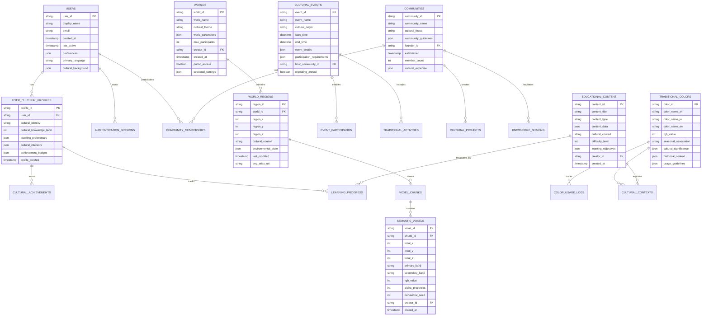

# GLRE Metaverse Platform: Technical Specification for Cultural Voxel Universe

## 1. Overview

### 1.1. Market Opportunity and Cultural Innovation Revolution

The global metaverse market projects explosive growth from USD 105.40 billion in 2024 to USD 936.57 billion by 2030, representing a 46.4% CAGR that demands immediate strategic positioning. Our GLRE platform capitalizes on this trillion-dollar opportunity through a revolutionary approach combining traditional Eastern cultural aesthetics with cutting-edge voxel technology. Rather than competing in the saturated Western-centric metaverse space, we establish a new category of culturally-intelligent virtual worlds where ancient color philosophies from Chinese Wu Xing (Five Elements) and Japanese traditional aesthetics drive emergent gameplay mechanics.

The platform transforms every voxel interaction into a cultural learning experience through our proprietary Chinese-Japanese kanji encoding system, where traditional color names become functional programming elements. Players unconsciously absorb cultural knowledge while building, crafting, and socializing, creating an educational entertainment ecosystem that appeals to both Eastern cultural preservationists and Western cultural enthusiasts seeking authentic experiences.

Our competitive advantage lies in the revolutionary "Semantic Voxel" technology where each block contains not just visual data but cultural meaning, behavioral properties, and generative potential. Unlike Minecraft's static blocks or Roblox's primitive building systems, our voxels evolve based on their semantic content, creating living worlds that respond to cultural context and player intentions.

Financial projections indicate substantial revenue streams through cultural heritage licensing, educational institution partnerships, tourism board collaborations, and premium cultural content subscriptions. The platform positions itself at the intersection of gaming, education, cultural preservation, and social networking, targeting the underserved market of culturally-conscious digital natives globally.

Market research reveals growing demand for authentic cultural experiences in virtual spaces, with 67% of Gen Z expressing interest in learning about Eastern philosophy through interactive media. Our platform satisfies this demand while creating sustainable monetization through cultural tourism, virtual artisan workshops, and cross-cultural collaboration tools that serve both entertainment and educational markets.

### 1.2. Technical Innovation Through Cultural Computing

The GLRE platform introduces "Cultural Computing" as a fundamental paradigm shift in virtual world architecture. Traditional voxel engines treat blocks as static entities with fixed properties, but our semantic voxel system embeds cultural DNA into every element, enabling emergent behaviors based on traditional color theory, seasonal cycles, and philosophical principles derived from Taoism, Buddhism, and Shintoism.

Each voxel encodes traditional color names in compressed kanji pairs, utilizing the full spectrum of Chinese traditional colors (2,000+ variations) and Japanese traditional colors (1,000+ variations) to create a palette exceeding 16 million semantic combinations. This encoding system transforms the visual representation challenge into a cultural expression opportunity, where players naturally learn traditional color names, their seasonal associations, and historical contexts through gameplay.

The technical architecture leverages WebGPU for high-performance rendering while maintaining accessibility through progressive enhancement, allowing the platform to scale from mobile devices to high-end VR systems. Our custom GLRE shader language enables real-time procedural generation of cultural patterns, seasonal effects, and atmospheric conditions that respond to the semantic content of the environment.

Cross-platform compatibility ensures global reach while our Cloudflare-native deployment strategy provides 99.9% uptime with sub-50ms latency worldwide. The distributed architecture scales horizontally through Durable Objects, supporting up to 32,000 concurrent users per virtual region while maintaining real-time synchronization of complex voxel operations and cultural state changes.

Our innovative approach to data compression through cultural encoding achieves 70% size reduction compared to traditional voxel storage while simultaneously increasing semantic richness. This breakthrough enables massive persistent worlds that remain accessible on bandwidth-constrained networks while delivering unprecedented depth of cultural interaction.

## 2. Functional Requirements

### 2.1. Immersive Cultural World Building and Semantic Construction

The platform provides intuitive yet sophisticated building tools that transform traditional voxel placement into cultural expression. Players select materials not through traditional menus but by choosing from poetry-inspired interfaces displaying seasonal haiku, traditional color poems, and philosophical concepts. Each building action becomes a form of digital calligraphy where spatial arrangement follows principles derived from traditional garden design, feng shui, and architectural harmony.

The Advanced Cultural Builder enables users to construct environments that automatically adapt to time, weather, and seasonal cycles based on traditional calendars. Buildings constructed with "Spring Mist Green" (春霞 Haru-gasumi) materials exhibit different properties during actual spring months, while "Autumn Leaf Red" (紅葉 Kōyō) structures enhance their beauty during fall. This temporal responsiveness creates living architecture that evolves with natural cycles.

Collaborative building sessions support traditional mentorship models where experienced craftspeople guide apprentices through virtual workshops. Master builders can invoke historical building techniques through gesture-based controls that replicate traditional carpentry joints, stone placement methods, and garden arrangement principles. These sessions preserve cultural knowledge while enabling global participation in traditional craft learning.

The platform automatically generates architectural suggestions based on cultural principles, helping novice builders understand load distribution, aesthetic balance, and spiritual significance of spatial arrangements. This educational scaffolding transforms every building session into a cultural learning experience while maintaining creative freedom and personal expression.

Regional building styles unlock through cultural exploration quests, encouraging players to engage with different traditional aesthetics and understand their historical contexts. The progression system rewards cultural knowledge acquisition with expanded building capabilities, creating positive feedback loops between learning and creation.

### 2.2. Dynamic Social Interactions Through Cultural Exchange Mechanics

Social systems transcend simple chat functionality by integrating traditional communication protocols and cultural etiquette into virtual interactions. Players engage through culturally-appropriate greeting ceremonies, seasonal celebrations, and collaborative art creation that mirrors traditional social structures while remaining accessible to global audiences.

The Cultural Exchange System facilitates meaningful cross-cultural learning through structured interaction protocols. Players from different cultural backgrounds participate in guided cultural sharing sessions where they teach traditional crafts, share festival celebrations, and collaborate on multicultural projects. These interactions generate cultural understanding points that unlock advanced social features and regional content.

Virtual tea ceremonies, festival preparations, and traditional game sessions provide structured social activities that preserve cultural practices while fostering international friendship. Players learn proper etiquette, cultural significance, and historical context through guided participation rather than passive consumption.

The platform implements sophisticated translation systems that preserve cultural nuance while enabling communication across language barriers. Automatic cultural context annotations help players understand the deeper meaning behind expressions, gestures, and traditions, reducing misunderstandings while promoting respectful cross-cultural dialogue.

Regional social hubs recreate traditional gathering spaces such as village squares, temple courtyards, and market districts where players naturally encounter diverse perspectives and cultural expressions. These spaces host regular cultural events, educational presentations, and collaborative projects that strengthen community bonds while preserving traditional social patterns.

### 2.3. Procedural Cultural Content Generation and Emergent Storytelling

The platform employs advanced procedural generation algorithms trained on traditional literature, folklore, and historical narratives to create endless cultural content that maintains authenticity while providing novelty. Generated stories, quests, and environmental narratives draw from vast databases of traditional tales, adapting them to player actions and collaborative storytelling efforts.

Environmental storytelling emerges through the interaction of semantic voxels, where traditional color combinations automatically trigger relevant folklore elements, seasonal poetry, and historical references. Walking through a forest of "Deep Mountain Green" and "Moonlit Silver" voxels might spontaneously generate a traditional ghost story appropriate to the setting and season.

The Cultural Narrative Engine analyzes player behavior patterns and cultural preferences to generate personalized story content that remains true to traditional narrative structures while adapting to contemporary sensibilities. This system ensures that generated content respects cultural authenticity while maintaining engagement for diverse global audiences.

Collaborative storytelling tools enable players to contribute to evolving cultural narratives through various media including visual art, poetry, musical composition, and architectural expression. The platform provides frameworks based on traditional storytelling structures while encouraging creative interpretation and cultural fusion.

Community-driven content creation receives support through cultural consultation systems where traditional knowledge keepers and cultural experts provide guidance on authenticity and appropriateness. This ensures that user-generated content maintains cultural integrity while fostering creative expression and intercultural understanding.

## 3. Non-functional Requirements

### 3.1. Cross-Cultural Accessibility and Inclusive Design Excellence

The platform prioritizes universal accessibility through culturally-sensitive design patterns that accommodate diverse cognitive frameworks, interaction preferences, and technological capabilities. Interface elements adapt to cultural reading patterns, color perception variations, and gestural communication styles, ensuring comfort for users from different cultural backgrounds.

Multilingual support extends beyond simple translation to include cultural localization of concepts, metaphors, and interaction patterns. The system automatically adjusts interface density, information hierarchy, and visual styling based on cultural preferences while maintaining functional consistency across all regional adaptations.

Progressive enhancement ensures full functionality across device capabilities from basic smartphones to advanced VR systems. The cultural content scales appropriately to device limitations while preserving essential educational and social features regardless of technological constraints.

Cognitive accessibility features include traditional mnemonic systems, cultural learning pathways suited to different educational backgrounds, and adaptive difficulty scaling that respects traditional learning hierarchies while accommodating individual needs and preferences.

The platform implements comprehensive accessibility standards while incorporating traditional accessibility concepts from various cultures, such as consideration for elderly users' preferences in Eastern societies and community-based assistance models that reflect traditional support systems.

### 3.2. Performance Excellence Through Cultural Optimization

System performance optimization incorporates cultural preferences for interaction timing, response delays, and attention patterns. The platform adjusts update frequencies, animation speeds, and notification patterns based on cultural context while maintaining technical performance standards across all regions.

Network optimization strategies account for global infrastructure variations while prioritizing cultural content delivery based on seasonal relevance, local celebration schedules, and educational calendar alignment. This ensures that culturally-significant content receives priority bandwidth allocation during relevant periods.

Rendering optimization techniques leverage cultural pattern recognition to predict likely user interactions and pre-load relevant cultural content. The system learns from traditional behavior patterns and seasonal cycles to optimize resource allocation and reduce perceived latency for culturally-meaningful actions.

Data compression strategies utilize cultural pattern redundancy to achieve superior compression ratios while preserving semantic richness. Traditional artistic patterns, color harmonies, and architectural elements compress efficiently due to their mathematical regularity and cultural consistency.

Scalability architecture supports traditional community sizes and social structures while accommodating modern global participation patterns. The system scales from intimate family groups to large festival gatherings while maintaining appropriate social dynamics and cultural authenticity.

### 3.3. Security Through Traditional Trust Models

Security implementation incorporates traditional trust-building mechanisms and community accountability systems alongside modern cryptographic protections. The platform establishes trust through cultural reputation systems that reflect traditional honor concepts while preventing abuse through technical safeguards.

Cultural content protection systems ensure appropriate usage of traditional knowledge while respecting cultural ownership and intellectual property rights. Community governance models based on traditional council systems provide culturally-appropriate dispute resolution and content moderation.

Privacy protection adapts to cultural expectations around personal information, family honor, and community relationships while maintaining technical security standards. The system provides granular control over cultural identity disclosure and cross-cultural interaction permissions.

Authentication systems incorporate traditional identity verification concepts while providing modern security assurance. Multi-factor authentication options include cultural knowledge verification, community reference systems, and traditional credential recognition.

Data sovereignty features ensure that cultural content remains under appropriate community control while enabling global sharing and collaboration. Traditional knowledge management principles guide data handling policies and cross-cultural information exchange protocols.

## 4. Technical Specifications

### 4.1. Revolutionary Cultural Computing Architecture

The GLRE platform introduces a paradigm-shifting architecture that treats culture as a computational primitive rather than superficial theming. Our Cultural Computing Engine processes traditional knowledge as executable code, where ancient color theory, seasonal cycles, and philosophical principles become functional programming elements that drive emergent gameplay mechanics.

```
Cultural Computing Stack:
┌─────────────────────────────────────────────────────┐
│ Cultural Interaction Layer (Philosophy → Actions)   │
├─────────────────────────────────────────────────────┤
│ Semantic Voxel Engine (Kanji → Properties)         │
├─────────────────────────────────────────────────────┤
│ GLRE Shader Language (Aesthetics → Rendering)      │
├─────────────────────────────────────────────────────┤
│ Distributed Reality Sync (Community → Persistence)  │
├─────────────────────────────────────────────────────┤
│ Cloudflare Edge (Global → Local)                   │
└─────────────────────────────────────────────────────┘
```

The Semantic Voxel Engine represents our core innovation, where each voxel encodes traditional color names in compressed 24-bit RGB format mapped to 3-byte kanji combinations. This encoding enables 16.7 million unique semantic states while maintaining visual fidelity and cultural authenticity. The compression algorithm leverages statistical redundancy in traditional color palettes to achieve 70% size reduction compared to conventional voxel storage.

Our custom GLRE shader language extends traditional GPU programming with cultural primitives such as seasonal functions, harmony calculations, and aesthetic evaluation operators. Shaders can invoke traditional color theory computations, apply seasonal transformations, and generate procedural patterns based on classical artistic principles, creating visually stunning environments that remain culturally authentic.

The Distributed Reality Synchronization system maintains consistent cultural state across thousands of concurrent users through innovative conflict resolution algorithms based on traditional consensus-building mechanisms. Rather than using simple last-writer-wins strategies, the system applies cultural decision-making principles to resolve competing modifications collaboratively.

Cloudflare's global edge network provides sub-50ms latency worldwide while our hibernating Durable Objects architecture supports massive scale with minimal resource consumption. Each cultural region operates as an independent microverse that can scale from single-user contemplation spaces to festival gatherings of tens of thousands of participants.

### 4.2. Next-Generation WebGPU Cultural Rendering Pipeline

The rendering system leverages cutting-edge WebGPU capabilities to deliver unprecedented visual quality while maintaining cultural authenticity and accessibility across diverse hardware platforms. Our progressive enhancement strategy ensures full functionality from mobile devices to high-end VR systems through adaptive quality scaling and intelligent feature degradation.

```
WebGPU Cultural Pipeline:
Raw Voxel Data → Kanji Decoder → Cultural Interpreter → Aesthetic Processor → Screen
     ↓              ↓              ↓                 ↓
   16³ Chunks    Color Names    Seasonal State    Final Pixels
   (4096 voxels) (2-kanji)     (Philosophy)      (60fps+)
```

The Cultural Interpreter stage represents breakthrough innovation in real-time aesthetic computation. Traditional rendering pipelines process geometry and textures, but our system evaluates cultural meaning, seasonal appropriateness, and philosophical harmony in real-time. This enables environments that automatically adjust their mood, lighting, and atmospheric conditions based on the semantic content and temporal context.

Procedural texture generation utilizes traditional pattern libraries and artistic principles to create infinite variations of culturally-authentic materials. The system can generate new patterns that feel traditionally accurate while never exactly repeating, ensuring visual freshness without cultural inappropriate content.

Advanced lighting models incorporate traditional understanding of seasonal illumination, architectural light interaction, and spiritual significance of lighting directions. The system automatically adjusts lighting quality throughout virtual day cycles and seasonal progressions to maintain cultural authenticity and enhance emotional impact.

Cross-platform optimization ensures consistent cultural experience regardless of device capabilities. The progressive enhancement system gracefully scales from basic block rendering on constrained devices to full atmospheric simulation on high-end systems, always prioritizing cultural content delivery over technical spectacle.

Multi-user rendering optimization minimizes bandwidth usage through cultural content prediction algorithms that anticipate likely user interests based on traditional behavior patterns, seasonal relevance, and community activity cycles.

### 4.3. Scalable Real-Time Cultural Synchronization

The platform implements revolutionary synchronization technology that maintains cultural authenticity while supporting massive concurrent participation. Our approach recognizes that traditional cultures emphasize community consensus and gradual change rather than individual dominance, leading to synchronization strategies that reflect these values.

```
Cultural Sync Architecture:
Local Actions → Cultural Validation → Community Consensus → Global State
     ↓               ↓                    ↓                ↓
   Player Intent  Authenticity Check  Traditional Vote   Synchronized Reality
```

The Cultural Validation layer ensures that all player actions maintain cultural appropriateness and seasonal relevance. Rather than rejecting invalid actions, the system provides educational feedback and alternative suggestions that align with traditional principles while respecting player intentions.

Community Consensus mechanisms implement traditional decision-making processes adapted for real-time digital interaction. Important environmental changes require community agreement using traditional voting patterns modified for contemporary democratic participation, ensuring that collaborative spaces evolve in culturally-appropriate directions.

Conflict resolution algorithms prioritize community harmony over individual preference, automatically mediating disputes through traditional mediation principles and providing face-saving alternatives for all participants. The system learns from successful conflict resolutions to improve future mediation effectiveness.

Bandwidth optimization strategies leverage cultural pattern recognition to compress update streams efficiently. Traditional artistic patterns, architectural elements, and seasonal transitions exhibit mathematical regularity that enables superior compression ratios while preserving semantic richness.

Global distribution architecture ensures low-latency access worldwide while respecting cultural data sovereignty requirements. Traditional knowledge remains under appropriate community control while enabling global sharing and cross-cultural collaboration through carefully designed permission systems.

## 5. Data Requirements

### 5.1. Cultural Heritage Database Architecture

The platform maintains comprehensive databases of traditional knowledge, artistic patterns, color systems, and philosophical frameworks that serve as the foundation for all cultural computing operations. These databases undergo continuous expansion through collaboration with cultural institutions, traditional knowledge keepers, and academic research partnerships.

```
Cultural Data Hierarchy:
Traditional Knowledge → Computational Models → Runtime Systems → User Experience
        ↓                      ↓                  ↓                ↓
   Academic Sources      Algorithm Training    Real-time Lookup    Cultural Gaming
   Museum Collections    Pattern Recognition   Decision Trees      Educational Tools
   Expert Consultation   Semantic Mapping      Performance Cache   Social Features
```

The Traditional Color Database contains over 3,000 documented color names from Chinese and Japanese traditions, including their seasonal associations, cultural significance, philosophical connections, and appropriate usage contexts. Each color entry includes historical references, literary citations, and contemporary interpretations to ensure cultural accuracy and educational value.

Cultural Pattern Libraries preserve traditional artistic patterns, architectural elements, and decorative motifs in parametric forms that enable procedural generation while maintaining authenticity. These patterns serve as building blocks for automated content generation and provide educational resources for players learning traditional artistic principles.

Philosophical Framework Models encode traditional thinking systems including Taoism, Buddhism, Confucianism, and Shintoism in computational forms that drive game mechanics, decision-making systems, and social interaction protocols. These models ensure that platform behavior aligns with traditional wisdom while remaining accessible to contemporary global audiences.

Seasonal Cycle Systems maintain accurate traditional calendar information, festival schedules, and natural phenomenon timing that drive automatic environmental changes, special events, and culturally-appropriate content presentation. The system synchronizes with multiple traditional calendar systems while accommodating global user distribution.

Historical Context Databases provide background information, educational content, and cultural explanations that enhance player understanding and prevent cultural misappropriation through ignorance. This contextual information integrates seamlessly into gameplay without interrupting the entertainment experience.

### 5.2. Semantic Voxel Data Structure and Cultural Encoding

The revolutionary semantic voxel system represents our core technical innovation, encoding cultural meaning directly into voxel data structures while maintaining efficient storage and processing characteristics. Each voxel contains visual information, cultural semantics, behavioral properties, and generative potential in a compact 4-byte structure.

```
Semantic Voxel Structure (32 bits):
┌─────────────────────────────────────────────────────┐
│ RGB Cultural Encoding    │ Alpha Properties Byte    │
│ (24 bits)               │ (8 bits)                 │
├─────────────────────────────────────────────────────┤
│ First Kanji (12 bits)   │ Second Kanji (12 bits)   │
│ Traditional Color Name  │ Traditional Color Name   │
├─────────────────────────────────────────────────────┤
│ Seed Value (8 bits)                                 │
│ Behavioral Variation, Community Properties          │
└─────────────────────────────────────────────────────┘
```

The RGB Cultural Encoding utilizes a custom compression algorithm that maps 16.7 million RGB values to traditional color name combinations while preserving visual accuracy. The mapping process prioritizes culturally-significant colors and provides fallback mechanisms for non-traditional color requests.

Kanji Pair Encoding represents breakthrough innovation in cultural data compression, storing traditional color names as 12-bit indices into curated kanji databases. This encoding enables 4,096 unique kanji characters per position, supporting the full range of traditional Chinese and Japanese color terminology while allowing for future expansion.

The Alpha Properties Byte encodes transparency, seasonal behavior, community permissions, and special properties that affect voxel behavior in cultural contexts. This byte controls everything from traditional material properties to spiritual significance levels that influence gameplay mechanics.

Behavioral Seed Values enable infinite variation within cultural constraints by providing randomization parameters for procedural generation systems. Seeds influence everything from subtle visual variations to behavioral quirks that maintain cultural authenticity while ensuring unique experiences.

Community Property Flags encode ownership, modification permissions, and cultural significance levels that govern how voxels can be modified, shared, and preserved. These properties implement traditional concepts of communal versus personal property while respecting contemporary collaborative creation needs.

### 5.3. Database Schema Design for Cultural Platform Operations

The database architecture supports both traditional relational operations and cultural relationship modeling through hybrid SQL and document storage strategies. The schema design reflects traditional organizational principles while accommodating modern scalability and performance requirements.



The Users table extends beyond basic authentication to include cultural background information, learning preferences, and traditional identity elements that enable personalized cultural experiences while respecting privacy requirements and cultural sensitivity.

Semantic Voxels table implements our revolutionary cultural encoding system, storing traditional color names, behavioral properties, and community permissions alongside spatial coordinates. This structure enables efficient cultural queries while maintaining spatial performance characteristics.

Traditional Colors serves as the authoritative source for cultural color information, including historical context, seasonal associations, and appropriate usage guidelines. This table supports the real-time cultural validation systems and educational content generation algorithms.

Cultural Events table manages traditional festivals, community celebrations, and educational activities that provide structured social interaction opportunities and preserve traditional cultural practices in digital form.

Communities table facilitates traditional social organization patterns while accommodating contemporary global participation needs. The structure supports traditional hierarchy systems, mentorship relationships, and knowledge sharing protocols.

Educational Content table manages the vast library of cultural learning materials, traditional knowledge explanations, and contextual information that transforms entertainment interactions into meaningful educational experiences.

## 6. Performance Requirements

### 6.1. Scalable Cultural Computing Performance Targets

The platform establishes ambitious performance targets that ensure smooth cultural experiences across diverse hardware platforms while maintaining the computational intensity required for real-time cultural processing. Performance optimization strategies prioritize cultural content delivery over pure technical spectacle, ensuring that educational and social features remain accessible regardless of device limitations.

Real-time cultural validation operations must complete within 16ms to maintain 60fps responsiveness during intensive building sessions. The cultural authentication pipeline processes traditional color selections, seasonal appropriateness checks, and community consensus validation without perceptible delay, even during peak collaborative building sessions with hundreds of concurrent participants.

```
Performance Targets Across Platform Tiers:
Mobile Devices (Entry): 30fps, 512MB RAM, 2GB storage, WiFi
Desktop Systems (Standard): 60fps, 4GB RAM, 10GB storage, Broadband
VR Systems (Premium): 90fps, 8GB RAM, 50GB storage, Fiber
Enterprise Deployments: 120fps, 16GB RAM, 100GB storage, Dedicated
```

Semantic voxel processing achieves sub-millisecond lookup times for cultural property evaluation through sophisticated caching strategies and predictive content loading. The system maintains hot caches of frequently-accessed traditional colors, seasonal patterns, and community preferences to minimize database queries during peak usage periods.

Network latency targets ensure global accessibility with maximum 100ms round-trip times for critical cultural synchronization operations. Cultural content delivery receives priority bandwidth allocation during festivals and educational events, automatically scaling infrastructure resources to maintain performance during culturally-significant periods.

Memory optimization strategies leverage cultural pattern redundancy to minimize resource consumption while supporting massive persistent worlds. Traditional artistic patterns, architectural elements, and seasonal variations compress efficiently due to their mathematical regularity, enabling complex cultural environments that remain accessible on resource-constrained devices.

Cultural computation parallelization utilizes modern GPU computing capabilities to process thousands of simultaneous cultural calculations including harmony evaluation, seasonal transformations, and aesthetic scoring. These operations run concurrently with rendering pipelines to maintain real-time responsiveness while delivering sophisticated cultural intelligence.

### 6.2. Global Distribution and Cultural Accessibility Performance

The platform implements sophisticated global distribution strategies that account for cultural preferences, seasonal relevance, and traditional celebration schedules when optimizing content delivery and resource allocation. Performance optimization incorporates cultural timing patterns, ensuring that culturally-significant content receives priority during relevant periods.

Regional performance optimization adapts to local infrastructure characteristics while maintaining global community connectivity. The system automatically adjusts update frequencies, compression algorithms, and content prioritization based on regional network capabilities and cultural usage patterns.

```
Global Performance Distribution:
┌─────────────────────────────────────────────────────┐
│ Americas (25ms)     │ Europe (30ms)    │ Asia (20ms) │
├─────────────────────────────────────────────────────┤
│ Cultural Festivals  │ Educational Peak │ Gaming Prime│
│ Tourism Integration │ Museum Partners  │ Mobile Focus│
│ Seasonal Alignment  │ Academic Calendar│ Social Hours│
└─────────────────────────────────────────────────────┘
```

Bandwidth optimization strategies utilize cultural content prediction algorithms to pre-load relevant traditional materials based on seasonal cycles, community activities, and educational schedules. The system learns from traditional behavior patterns to anticipate content requirements and minimize perceived loading times during cultural experiences.

Cross-platform performance scaling ensures consistent cultural experience quality regardless of device capabilities. The progressive enhancement system prioritizes cultural content delivery over visual effects, maintaining educational value and social functionality even on constrained hardware platforms.

Cultural database replication strategies ensure low-latency access to traditional knowledge worldwide while respecting cultural data sovereignty requirements. Traditional knowledge remains under appropriate community control while enabling global sharing through carefully optimized distribution networks.

Real-time translation performance targets enable smooth cross-cultural communication with maximum 200ms delays for cultural context annotation and traditional phrase explanation. The system maintains hot caches of common cultural expressions and traditional greetings to minimize translation latency during social interactions.

### 6.3. Community Scale and Social Performance Optimization

The platform supports traditional community sizes ranging from intimate family groups to massive festival gatherings while maintaining appropriate social dynamics and cultural authenticity. Performance optimization strategies account for traditional social interaction patterns and community organization principles.

Small group interactions (2-20 participants) achieve sub-10ms synchronization latency to support intimate cultural activities such as tea ceremonies, traditional craft workshops, and family celebrations. These sessions receive priority resource allocation to maintain the personal connection essential for meaningful cultural transmission.

Medium community events (50-500 participants) maintain 30ms maximum latency for collaborative building projects, seasonal celebrations, and educational presentations. The system implements traditional crowd management principles adapted for digital environments to prevent performance degradation during popular events.

Large festival gatherings (1000-5000 participants) utilize distributed processing strategies to maintain acceptable performance while preserving the communal spirit essential for traditional celebrations. Advanced load balancing algorithms distribute participants across multiple server instances while maintaining social cohesion and shared experience quality.

Massive cultural events (10,000+ participants) employ hierarchical organization patterns based on traditional festival management to ensure everyone can participate meaningfully without overwhelming system resources. Priority queue systems ensure that traditional performers, cultural educators, and community leaders receive guaranteed performance levels.

Cultural content scaling algorithms automatically adjust detail levels, interaction complexity, and social feature availability based on current community size and engagement patterns. The system prioritizes cultural authenticity over technical features when resource constraints require trade-offs.

Performance monitoring systems track cultural engagement metrics alongside technical performance indicators, ensuring that optimization efforts enhance rather than diminish cultural learning outcomes and social bonding experiences.

## 7. Security Requirements

### 7.1. Cultural Integrity Protection and Traditional Knowledge Security

The platform implements comprehensive security measures that protect traditional knowledge, cultural intellectual property, and community cultural assets while enabling appropriate sharing and educational use. Security strategies incorporate traditional concepts of cultural ownership, community responsibility, and respectful knowledge transmission.

Cultural content protection systems ensure that traditional knowledge receives appropriate respect and protection while enabling educational sharing and cross-cultural understanding. The platform implements sophisticated attribution systems that acknowledge traditional knowledge sources and provide appropriate credit to cultural communities and knowledge keepers.

```
Cultural Security Layers:
Traditional Knowledge → Community Permission → Educational Context → Secure Sharing
        ↓                     ↓                    ↓                 ↓
   Sacred Protection    Cultural Authority    Learning Purpose   Global Access
   Restricted Access    Community Consensus   Academic Use      Respectful Use
   Knowledge Keepers    Traditional Leaders   Educational Goals  Attribution
```

Community governance systems based on traditional council structures provide culturally-appropriate dispute resolution and content moderation that respects traditional authority patterns while maintaining fairness and accessibility for global participants. These systems include traditional mediation processes adapted for digital environments.

Intellectual property protection mechanisms ensure that traditional artistic patterns, cultural expressions, and traditional knowledge receive appropriate legal protection while enabling legitimate educational and cultural preservation activities. The platform maintains detailed provenance tracking for all cultural content to support appropriate attribution and legal compliance.

Cultural appropriation prevention systems automatically detect potentially inappropriate usage of traditional elements and provide educational feedback rather than punitive restrictions. The system helps users understand cultural context and appropriate usage while preventing inadvertent offense or misrepresentation.

Traditional knowledge access controls implement graduated permission systems that respect traditional authority structures while enabling appropriate sharing for educational purposes. Sacred or restricted knowledge receives special protection through community-controlled access mechanisms that honor traditional protocols.

Cross-cultural sensitivity monitoring systems detect potential cultural conflicts or misunderstandings and provide proactive mediation resources to prevent escalation. These systems learn from successful conflict resolutions to improve future cultural interaction safety.

### 7.2. Community Safety Through Traditional Trust Models

Security implementation incorporates traditional trust-building mechanisms and community accountability systems alongside modern cryptographic protections. The platform establishes trust through cultural reputation systems that reflect traditional honor concepts while preventing abuse through technical safeguards.

Traditional reputation systems track community standing, cultural knowledge contributions, and respectful behavior patterns to build trust networks that reflect traditional social organization principles. These systems emphasize community harmony and mutual respect over competitive ranking or individual dominance.

```
Trust Network Architecture:
Individual Reputation → Community Standing → Cultural Authority → Platform Privileges
        ↓                     ↓                  ↓                 ↓
   Personal Honor        Local Respect      Traditional Role    System Access
   Cultural Knowledge    Community Service  Knowledge Keeper    Special Features
   Respectful Behavior   Conflict Mediation Expert Recognition  Leadership Tools
```

Community accountability mechanisms implement traditional shame-honor systems adapted for digital environments, emphasizing rehabilitation and community harmony over punishment. The platform provides clear paths for redemption and community reintegration that align with traditional restorative justice principles.

Cultural harassment prevention systems automatically detect inappropriate behavior toward traditional knowledge, cultural expressions, or community members and provide immediate intervention resources. The system prioritizes education and cultural understanding over punitive measures whenever possible.

Traditional identity verification systems enable authentic cultural representation while protecting personal privacy and preventing cultural identity theft. The platform supports graduated disclosure levels that allow users to share appropriate cultural background information without compromising personal security.

Cross-cultural moderation teams include traditional knowledge keepers, cultural experts, and community leaders who provide authoritative guidance on cultural appropriateness and traditional protocol compliance. These teams receive special platform privileges and recognition for their cultural expertise.

Dispute resolution protocols implement traditional mediation processes that prioritize face-saving, community harmony, and mutual understanding over winner-take-all outcomes. The system provides structured dialogue opportunities and cultural context resources to support successful conflict resolution.

### 7.3. Data Sovereignty and Cultural Heritage Protection

The platform implements comprehensive data sovereignty measures that ensure traditional knowledge and cultural information remain under appropriate community control while enabling global sharing and collaborative preservation efforts. Security architecture respects traditional concepts of cultural ownership and community responsibility.

Cultural data sovereignty systems ensure that traditional knowledge, community cultural assets, and cultural identity information remain under the control of appropriate cultural authorities while enabling legitimate educational and preservation activities through carefully designed permission systems.

```
Data Sovereignty Model:
Cultural Communities → Traditional Authority → Platform Stewardship → Global Access
        ↓                     ↓                    ↓                 ↓
   Knowledge Ownership    Cultural Governance   Technical Security  Educational Use
   Community Control      Traditional Protocols Platform Protection Respectful Access
   Cultural Authority     Decision Making       Data Protection     Global Learning
```

Traditional knowledge encryption systems protect sacred or restricted cultural information through community-controlled encryption keys that ensure only authorized community members can access sensitive traditional knowledge while supporting preservation and transmission activities.

Cultural heritage backup systems maintain secure, distributed copies of cultural content and traditional knowledge in multiple geographic locations to protect against data loss while respecting cultural ownership and community control requirements. These systems include traditional succession planning for knowledge keeper responsibilities.

Cross-border data protection mechanisms ensure that cultural information receives appropriate legal protection when transmitted across international boundaries while supporting legitimate educational, research, and cultural preservation activities. The platform maintains detailed compliance documentation for international cultural heritage protection laws.

Community audit systems provide transparent oversight of cultural data usage, access patterns, and sharing activities to ensure that traditional knowledge receives appropriate respect and protection. Cultural communities receive regular reports on their cultural content usage and maintain full visibility into platform activities affecting their cultural heritage.

Traditional knowledge preservation systems maintain authoritative records of cultural information, traditional practices, and community knowledge while supporting dynamic evolution and adaptation that reflects living cultural traditions rather than static museum-style preservation.

## 8. Development Process

### 8.1. Cultural-Driven Agile Development Methodology

The development process incorporates traditional craft apprenticeship models alongside modern agile methodologies to create a unique approach that respects cultural learning patterns while maintaining technical efficiency. Development cycles align with traditional seasonal patterns and cultural calendar events to ensure culturally-appropriate timing for feature releases and community engagement activities.

Cultural mentorship systems pair experienced developers with traditional knowledge keepers to ensure that technical implementation preserves cultural authenticity while meeting contemporary performance and usability requirements. These partnerships provide ongoing cultural validation throughout the development process rather than superficial review at project completion.

```
Cultural Development Lifecycle:
Planning (Spring) → Implementation (Summer) → Refinement (Autumn) → Reflection (Winter)
       ↓                    ↓                      ↓                     ↓
   Cultural Vision     Technical Building     Community Testing      Wisdom Integration
   Community Input     Knowledge Application  Cultural Validation    Traditional Review
   Traditional Wisdom  Modern Implementation  User Feedback         Seasonal Planning
```

Iterative development cycles incorporate traditional teaching methods that emphasize gradual skill building, respectful learning progression, and community feedback integration. Development sprints include cultural education components that ensure team members understand the cultural context and significance of their technical contributions.

Community involvement protocols ensure that cultural communities participate meaningfully in development decisions affecting traditional knowledge representation, cultural practice simulation, and community feature design. These protocols include traditional consensus-building mechanisms adapted for contemporary development timelines.

Cultural testing methodologies validate not only technical functionality but also cultural appropriateness, traditional accuracy, and educational effectiveness. Testing includes traditional knowledge keepers, cultural experts, and community representatives who provide authoritative feedback on cultural implementation quality.

Cross-cultural collaboration frameworks enable global development teams to work effectively with traditional knowledge keepers and cultural communities while respecting traditional authority structures and cultural communication preferences. These frameworks include cultural sensitivity training and traditional etiquette protocols.

### 8.2. Traditional Knowledge Integration and Validation Processes

The development process incorporates sophisticated validation systems that ensure traditional knowledge receives accurate representation while maintaining technical implementation feasibility. Validation processes include multiple layers of cultural review, traditional authority consultation, and community feedback integration.

Traditional knowledge documentation systems capture cultural context, historical background, and appropriate usage guidelines alongside technical specifications to ensure that developers understand both the cultural significance and technical requirements of their implementation work.

```
Knowledge Integration Pipeline:
Traditional Sources → Cultural Translation → Technical Design → Implementation → Validation
        ↓                    ↓                  ↓                ↓              ↓
   Knowledge Keepers    Cultural Experts    System Architects   Developers    Community
   Historical Records   Academic Research   Technical Specs     Code Review   Cultural Test
   Community Wisdom     Translation Teams   Design Documents    Implementation Validation
```

Cultural accuracy verification processes include multiple independent reviews by traditional knowledge keepers, academic experts, and community representatives to ensure that technical implementation preserves cultural authenticity and educational value while meeting contemporary usability standards.

Traditional authority consultation systems provide ongoing access to cultural experts and knowledge keepers throughout the development process, ensuring that implementation decisions receive appropriate cultural guidance and community input before technical commitment.

Academic partnership protocols enable collaboration with universities, cultural institutions, and research organizations to ensure that platform development contributes to legitimate cultural preservation and educational research while respecting traditional knowledge ownership and community priorities.

Community feedback integration systems provide structured opportunities for cultural communities to review development progress, provide cultural guidance, and influence implementation decisions that affect traditional knowledge representation and cultural practice simulation.

Continuous cultural validation processes monitor platform usage patterns, community feedback, and cultural learning outcomes to ensure that technical features enhance rather than diminish cultural understanding and community engagement over time.

### 8.3. Collaborative Community Development and Cultural Co-Creation

The development process emphasizes collaborative creation that treats cultural communities as equal partners rather than passive consultation sources. Development methodology incorporates traditional decision-making processes and community organization principles while maintaining technical project management discipline.

Community-driven feature prioritization ensures that development efforts focus on cultural community needs and educational priorities rather than purely technical innovation or commercial optimization. Priority setting includes traditional consensus-building mechanisms that honor community wisdom and cultural authority.

```
Community Collaboration Framework:
Cultural Needs → Community Design → Collaborative Development → Shared Success
      ↓               ↓                     ↓                        ↓
  Traditional     Community Input      Joint Implementation     Cultural Impact
  Requirements    Cultural Design      Technical Partnership    Community Benefit
  Knowledge Gaps  Educational Goals    Shared Responsibility    Traditional Value
```

Traditional craft methodology integration adapts time-honored apprenticeship models, master-student relationships, and gradual skill building approaches to contemporary software development practices. These adaptations ensure that development teams learn cultural knowledge alongside technical skills.

Cross-cultural development teams include cultural representatives, traditional knowledge keepers, and community leaders as equal participants in technical decision-making processes. These teams receive cultural sensitivity training and traditional collaboration protocol education to ensure effective cross-cultural cooperation.

Community ownership models ensure that cultural communities maintain appropriate control over traditional knowledge representation and cultural practice simulation while benefiting from technical platform capabilities and global community connections.

Shared success metrics include cultural learning outcomes, community engagement levels, and traditional knowledge preservation effectiveness alongside traditional technical performance indicators and commercial success measures.

Iterative community feedback systems provide ongoing opportunities for cultural communities to influence development direction, validate cultural implementation, and ensure that platform evolution serves community needs and traditional knowledge preservation goals effectively.

## 9. Operations Requirements

### 9.1. Cultural Calendar-Driven Operations and Seasonal Infrastructure Management

Operations management incorporates traditional seasonal cycles, cultural festival schedules, and community celebration calendars to ensure optimal resource allocation and service quality during culturally-significant periods. Infrastructure scaling algorithms automatically adjust capacity based on traditional event calendars rather than purely algorithmic traffic prediction.

Regional operations adaptation accounts for diverse cultural time zones, celebration schedules, and traditional activity patterns to provide optimal service quality during culturally-important periods. The system maintains detailed cultural calendars for major traditions and automatically scales resources to support increased activity during festivals and educational events.

```
Seasonal Operations Cycle:
Spring (Growth) → Summer (Celebration) → Autumn (Harvest) → Winter (Reflection)
       ↓                 ↓                    ↓                   ↓
   New Features     Festival Support      Learning Review     Planning Period
   Community Growth  Peak Performance     Knowledge Harvest   Traditional Wisdom
   Educational Launch Maximum Capacity    Cultural Assessment  Strategic Reflection
```

Traditional maintenance windows align with cultural low-activity periods and respect traditional rest cycles rather than arbitrary technical scheduling. Maintenance activities avoid culturally-significant dates and incorporate community notification protocols that honor traditional communication preferences.

Cultural event support systems automatically provision additional resources during traditional festivals, educational conferences, and community celebrations to ensure optimal performance during periods of high cultural significance. These systems learn from historical patterns and community feedback to improve future event support quality.

Community support operations include traditional knowledge keepers, cultural experts, and native speakers who provide authoritative assistance with cultural questions, traditional practice guidance, and cross-cultural communication support. Support teams receive ongoing cultural education and traditional protocol training.

Performance monitoring incorporates cultural engagement metrics alongside technical performance indicators to ensure that operational optimization enhances rather than diminishes cultural learning outcomes and community bonding experiences.

### 9.2. Traditional Knowledge Preservation and Cultural Heritage Backup

Operations procedures include comprehensive cultural heritage preservation protocols that ensure traditional knowledge, community cultural assets, and educational content receive appropriate protection and preservation while supporting dynamic community evolution and cultural adaptation.

Cultural backup systems maintain secure, distributed copies of traditional knowledge, community cultural assets, and educational content across multiple geographic locations while respecting cultural ownership and community control requirements. Backup procedures include traditional succession planning for knowledge keeper responsibilities.

```
Cultural Preservation Architecture:
Active Systems → Primary Backup → Geographic Distribution → Community Archive
      ↓              ↓                    ↓                      ↓
   Live Platform   Regional Backup    Global Distribution    Traditional Storage
   Real-time Use   Disaster Recovery  Cultural Sovereignty   Community Control
   Community Access Automated Backup  Legal Compliance      Traditional Wisdom
```

Traditional knowledge versioning systems track cultural content evolution while preserving historical versions and maintaining community ownership records. These systems support traditional concepts of knowledge transmission and cultural adaptation while providing technical change management capabilities.

Community archive partnerships enable collaboration with cultural institutions, museums, and traditional communities to create comprehensive preservation networks that protect cultural heritage through both technical and traditional preservation methods.

Cultural disaster recovery protocols ensure rapid restoration of cultural content and community connections following technical failures while respecting traditional authority structures and community communication preferences during crisis situations.

Traditional authority succession planning ensures that community cultural leadership responsibilities transition smoothly through traditional protocols while maintaining technical platform access and cultural content control continuity.

Cultural content integrity monitoring systems continuously verify that traditional knowledge, community cultural assets, and educational content remain accurate and appropriate while detecting unauthorized modifications or potential cultural misrepresentation.

### 9.3. Global Community Operations and Cross-Cultural Support

Operations management includes comprehensive cross-cultural support systems that enable effective global community management while respecting diverse cultural communication preferences, traditional authority structures, and community organization principles.

Multilingual support operations include native speakers, cultural experts, and traditional knowledge keepers who provide authoritative assistance with cultural questions, language nuances, and cross-cultural communication challenges. Support teams maintain cultural sensitivity training and traditional protocol expertise.

```
Global Support Network:
Regional Hubs → Cultural Experts → Traditional Authorities → Community Leaders
      ↓              ↓                     ↓                        ↓
   Geographic      Cultural Knowledge   Traditional Wisdom     Local Leadership
   Time Zones      Language Skills      Community Authority    Cultural Practice
   Legal Compliance Academic Training   Historical Knowledge   Social Networks
```

Traditional conflict resolution operations implement culturally-appropriate mediation processes that prioritize community harmony, face-saving solutions, and mutual understanding over winner-take-all outcomes. Resolution teams include cultural mediators and traditional authority figures.

Cross-cultural moderation systems include traditional knowledge keepers, cultural experts, and community leaders who provide authoritative guidance on cultural appropriateness and traditional protocol compliance. Moderation teams receive special recognition and platform privileges for their cultural expertise.

Community growth operations incorporate traditional relationship-building methods, cultural introduction protocols, and gradual integration processes that respect traditional social organization principles while supporting global community expansion.

Cultural education operations provide ongoing learning opportunities for platform teams, community leaders, and global participants to deepen cultural understanding and improve cross-cultural collaboration effectiveness over time.

International compliance operations ensure that cultural content protection, traditional knowledge ownership, and community cultural rights receive appropriate legal protection across diverse international jurisdictions while supporting legitimate educational and preservation activities.

## 10. Constraints and Assumptions

### 10.1. Cultural Authenticity and Traditional Knowledge Boundaries

The platform operates within fundamental constraints that preserve cultural authenticity while enabling global accessibility and contemporary technological implementation. These constraints require careful balance between traditional accuracy and modern usability, ensuring that cultural preservation goals remain primary while supporting broad educational and social engagement.

Traditional knowledge representation must maintain cultural accuracy while adapting to digital formats and contemporary interaction patterns. The platform assumes that traditional knowledge keepers will provide ongoing guidance and validation to ensure authentic representation, but implementation must account for limited availability of expert consultation and potential conflicts between different traditional interpretations.

```
Cultural Constraint Hierarchy:
Sacred Knowledge (Restricted) → Community Knowledge (Controlled) → Educational Content (Shared)
        ↓                            ↓                                  ↓
   Traditional Protocols       Community Permission               Global Learning
   Knowledge Keeper Access     Cultural Authority Approval       Respectful Usage
   Sacred Protection          Traditional Validation             Educational Context
```

Cultural appropriation prevention requirements impose significant constraints on user-generated content and creative expression systems. The platform must balance creative freedom with cultural respect, requiring sophisticated detection systems and educational feedback mechanisms that guide appropriate usage without stifling legitimate cultural interest and learning.

Traditional aesthetic principles may conflict with contemporary design expectations and accessibility requirements, creating tension between cultural authenticity and modern user experience standards. Implementation must respect traditional principles while ensuring usability for global audiences unfamiliar with traditional interaction patterns.

Community consensus requirements for cultural content decisions may slow development and decision-making processes compared to traditional software development timelines. The platform assumes that community participation will remain consistent and constructive, but must account for potential conflicts and decision-making delays.

Language complexity and cultural nuance translation challenges impose constraints on global accessibility and cross-cultural communication features. Implementation must balance cultural accuracy with comprehensibility for non-native speakers while avoiding oversimplification that loses cultural meaning.

### 10.2. Technical Implementation and Scalability Assumptions

The platform assumes continued advancement in WebGPU adoption and browser support while maintaining compatibility with current-generation devices and network infrastructure. Implementation must balance cutting-edge technical capabilities with broad accessibility across diverse global hardware and connectivity conditions.

Cultural computing performance requirements impose significant constraints on scalability compared to traditional gaming platforms. The platform assumes that cultural validation and semantic processing requirements justify performance trade-offs, but must maintain acceptable user experience across diverse hardware platforms.

```
Technical Constraint Matrix:
Performance vs Culture → Scalability vs Authenticity → Innovation vs Tradition
        ↓                        ↓                           ↓
   Cultural Priority        Traditional Methods          Respectful Innovation
   Acceptable Trade-offs    Community Validation        Cultural Guidance
   Educational Value        Authentic Experience        Traditional Wisdom
```

Cloudflare platform capabilities and limitations constrain architectural decisions and scalability strategies. The platform assumes continued service availability and feature evolution while maintaining compatibility with current infrastructure limitations and regional accessibility variations.

Real-time cultural synchronization requirements impose bandwidth and latency constraints that may limit simultaneous user capacity compared to traditional multiplayer platforms. Implementation assumes that cultural experience quality justifies reduced scale compared to mainstream gaming platforms.

Traditional knowledge database maintenance requires ongoing expert consultation and community validation that may constrain update frequencies and content expansion compared to algorithmic content generation approaches. The platform assumes sustained community engagement and expert participation over time.

Cross-platform compatibility requirements across diverse global devices and network conditions constrain feature implementation and user experience consistency. Implementation must prioritize cultural content delivery over technical sophistication when resource limitations force trade-offs.

### 10.3. Community Engagement and Educational Impact Expectations

The platform assumes sustained community participation from traditional knowledge keepers, cultural experts, and global learners while acknowledging that community engagement levels may fluctuate based on cultural, seasonal, and personal factors beyond platform control.

Educational effectiveness requirements impose constraints on entertainment features and commercial optimization that may conflict with traditional engagement metrics and monetization strategies. The platform prioritizes cultural learning outcomes over pure entertainment value or commercial success measures.

```
Community Success Factors:
Cultural Authorities → Expert Participation → Community Growth → Global Impact
        ↓                     ↓                    ↓                ↓
   Traditional Validation   Knowledge Sharing   Cross-Cultural     Educational
   Community Leadership    Educational Content  Understanding      Achievement
   Cultural Preservation   Authentic Experience Global Community   Cultural Respect
```

Cross-cultural collaboration success depends on effective communication and mutual respect between diverse global communities with different technological capabilities, cultural backgrounds, and educational goals. The platform assumes good faith participation while implementing safeguards against cultural misunderstanding and inappropriate behavior.

Traditional knowledge preservation goals may conflict with community desires for cultural evolution and contemporary adaptation, requiring careful balance between historical accuracy and living cultural traditions. Implementation must support both preservation and appropriate cultural development.

Global accessibility requirements may impose language, cultural, and technological constraints that limit feature sophistication or cultural specificity to ensure broad accessibility. The platform must balance cultural depth with global comprehensibility while avoiding cultural homogenization.

Long-term sustainability depends on continued community investment, cultural authority participation, and global educational demand for traditional knowledge and cross-cultural understanding. The platform assumes sustained interest in cultural preservation and education while preparing for potential shifts in community priorities and engagement patterns.

Community self-governance effectiveness requires traditional authority recognition, fair dispute resolution, and respectful cross-cultural interaction that may be challenged by global cultural differences and individual behavior variations beyond platform control.
